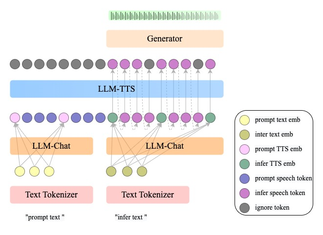

<h1 align='center'>JoyTTS: LLM-based Spoken Chatbot With Voice Cloning</h1>

<div align='center'>
    <a href='https://github.com/zhoufangru' target='_blank'>Zhou Fangru</a> 
    <a href='https://github.com/zhaojun060708' target='_blank'>Jun Zhao</a> 
    Guoxin Wang
</div>
<div align='center'>
    JD Health International Inc.
</div>

<br>
<div align='center'>
    <a href='https://huggingface.co/jdh-algo/JoyTTS-v1'></a>
</div>
<br>

## 📖 Introduction

JoyTTS is an end-to-end spoken chatbot that combines large language models (LLM) with text-to-speech (TTS) technology, featuring voice cloning capabilities. This project is built upon the open-source MiniCPM-o and CosyVoice2 models and trained on 2000 hours of conversational data. We have also provided the complete training code to facilitate further development and optimization by the community. On the testing machine seed-tts-zh, it achieves a SS (speaker similarity) score of 0.73 and a WER (Word Error Rate) of 5.09.


### 🧳 Framework



### 🎬 Demo


<table>
<tr>
<td width="25%">
问题
</td>
<td width="25%">
孙悟空
</td>
<td width="25%">
猪八戒
</td>
<td width="25%">
林黛玉
</td>
</tr>
<tr>
<td width="25%">
参考音频
</td>
<td width="25%">
    
https://github.com/user-attachments/assets/c7b1c703-3513-44a6-91a6-24729ae2c652
</td>
<td width="25%">

https://github.com/user-attachments/assets/284acc8c-f15f-41ef-9af2-05d6aba70692
</td>
<td width="25%">

https://github.com/user-attachments/assets/46a9e2b4-aabf-46ea-99b2-b41bccd1b683
</td>
</tr>
<tr>
<td width="25%">
“今天天气怎么样”
</td>
<td width="25%">

https://github.com/user-attachments/assets/56ac6536-72b9-4e93-819d-136f091c0b04
</td>
<td width="25%">

https://github.com/user-attachments/assets/7d4057f5-d139-4055-bc04-f081632b452b
</td>
<td width="25%">

https://github.com/user-attachments/assets/b3a1fc21-73f3-444a-8fe9-67f98f4b1a2c
</td>
</tr>
<tr>
<td width="25%">
“中国的全称是什么”
</td>
<td width="25%">
    
https://github.com/user-attachments/assets/0e8bce5b-0a70-4e5b-9010-46baa0c0cdd3
</td>
<td width="25%">

https://github.com/user-attachments/assets/051c3c14-f261-4c97-b281-95c80eb409c5
</td>
<td width="25%">

https://github.com/user-attachments/assets/f58ba707-86cd-48cf-916e-dde6217e83a4
</td>
</tr>
<tr>
<td width="25%">
“手机都有哪些作用？”
</td>
<td width="25%">

https://github.com/user-attachments/assets/79418095-470e-4b16-830c-9ff835df6852
</td>
<td width="25%">

https://github.com/user-attachments/assets/38d5db81-2077-47d5-8cf2-45c8911349ae
</td>
<td width="25%">

https://github.com/user-attachments/assets/bdaa784e-2419-4620-a94d-be87cbb79c7f
</td>
</tr>
</table>


### 💻 Results on SEED test-zh

|             Model             | SS $\uparrow$ | WER $\downarrow$ |
| :---------------------------: | :------: | :----: |
|     gpt-sovits     |  0.55  | 5.13 |
|     cosyvoice2     |   **0.748**   |  **1.45**  |
|     Minicpm-o      |  0.57  |  -   |
|     JoyTTS         |  0.73  | 5.09 |


## ⚙️ Installation

### 1. Create Conda env

``` sh
conda create -n JoyTTS -y python=3.10
conda activate JoyTTS
conda install -y -c conda-forge pynini==2.1.5
pip install -r requirements_JoyTTS.txt -i https://mirrors.aliyun.com/pypi/simple/ --trusted-host=mirrors.aliyun.com
cp third_party/deepspeed/elasticity/elastic_agent.py $conda_envs/JoyTTS/lib/python3.10/site-packages/deepspeed/elasticity/elastic_agent.py
```

### 2. Model download

``` sh
huggingface-cli download --resume-download --repo-type model jdh-algo/JoyTTS-v1 --local-dir pretrained_models
```

## 🚀 Inference

### 1. Use spk_id

1. Change the prompt info in pretrained_models/prompt_info.py
2. Delete pretrained_models/spk2info.pt
3. Run the following command

```shell
python inference.py --question '今天天气怎么样？' --spk_id '孙悟空' 
```

### 2. Use prompt info
```shell
python inference.py --question '今天天气怎么样？' --prompt_text 'prompt text' --prompt_wav the_path_of_prompt_wav 
```
The result will be saved in "output.wav"


### 3. Gradio demo
```shell
python gradio_demo.py
```


## 🚧 Fine-tuning
### 1. Data preparation

#### 1. Prepare conversation data for LLM-Chat
<details>
  <summary>
    <b>example (normalized_data.json) with 1 sample.</b>
  </summary>

```
  [
    {
      "utt": "0",
      "reference": '数字银行 《数字银行》是2015年12月新世界出版社出版的金融类图书，该书的作者是刘振友。 书 名 数字银行 作 者 刘振友 类 别 金融 出版社 新世界出版社 出版时间 2015年12月 页 数 290 页 定 价 48.8 开 本 16 开 装 帧 平装 ISBN 978-7-5104-5480-6 数字银行内容简介 《数字银行》认为，传统银行若要更好地存续，必须实现自我进化。本书还将带你穿越历史，解读现代金融行业的发展轨道，知古鉴今，把握未来银行的发展思维脉络。 数字银行作者简介 刘振友是全球第一批致力于加密数字资产、数字货币、虚拟货币、商业积分、共赢经济模式、全民免费经济领域研究、应用、推广的资深专家，新锐作家。主要著作有:《颠覆》《3分钟让别人记住你》《互联网+》《数字银行》《让世界免费》。 数字银行作品目录',
      "conversations": [
            {
              'role': 'user', 
              'content': '请问这本《数字银行》是什么时候出版的？'
            }, 
            {
                'role': 'assistant', 
                'content': '这本《数字银行》是2015年12月出版的。它是一本金融类图书，由新世界出版社出版。了解这本书的出版时间可以帮助你了解它的时效性，从而了解该书所描述的内容和观点是否仍然适用于当前的金融环境。'
            },   
            {
                'role': 'user', 
                'content': '作者刘振友都写过哪些其他书籍？'
            },
            {
                'role': 'assistant', 
                'content': '刘振友是一位新锐作家，他的主要著作有《颠覆》、《3分钟让别人记住你》、《互联网+》、《数字银行》和《让世界免费》。他是全球第一批致力于加密数字资产、数字货币、虚拟货币、商业积分、共赢经济模式、全民免费经济领域研究、应用、推广的资深专家。了解他的其他著作可以帮助你更全面地了解他的思想和研究领域。'
            }, 
        ]
    },
  ]
```
</details>

#### 2. Prepare data for  LLM-TTS
To enhance the efficiency of training the LLM-TTS model, we pre-generated hidden states using the already trained LLM-Chat model.

##### launch server
```shell
cd prepare_data_sever and python sever_llmanswer.py
cd prepare_data_sever and python sever_tts.py
```
##### generate parquet file
```shell
cd prepare_data_generate
python 0_generate_datalist.py --data_root your_data_root --data_name your_data_name
python 1_generate_llmanswer.py --data_root your_data_root --data_name your_data_name
python 2_generate_tts.py --data_root your_data_root --data_name your_data_name
python 3_split_train_eval_offline.py --data_root your_data_root --data_name your_data_name
python 4_make_parquet_list.py --data_root your_data_root --data_name your_data_name
```
The generated data will be saved in {your_data_root}/parquet/{your_data_name}

#### 3. Prepare data for end-to-end training
##### launch server
```shell
cd prepare_data_sever and python sever_tts.py
```
##### generate parquet file
```shell
cd prepare_data_generate_end2end
python 0_generate_datalist.py --data_root your_data_root --data_name your_data_name
python 2_generate_tts.py --data_root your_data_root --data_name your_data_name
python 3_split_train_eval_offline.py --data_root your_data_root --data_name your_data_name
python 4_make_parquet_list.py --data_root your_data_root --data_name your_data_name
```
The generated data will be saved in {your_data_root}/parquet_uselabel/{your_data_name}


### 2. Start train
#### 1. LLM-TTS model only

``` shell
cd examples/end2end
ln -s your_data_root data
sh run.sh #set stage=1
```
#### 2. end-to-end training

``` shell
cd examples/end2end
ln -s your_data_root data
sh run.sh #set stage=2
```

## 🎒 TODO
- [x] training and inference codes.
- [x] trained models and technical report.
- [x] freestyle dialogue model with voice cloning.
- [ ] vllm support.
- [ ] a better and faster model.
- [ ] automatic emotion control.


## 📝 Citations

If you find our work helpful, please consider citing us:

```
@misc{zhou2025joytts,
  title={JoyTTS: LLM-based Spoken Chatbot With Voice Cloning}, 
  author={Fangru Zhou and Jun Zhao and Guoxin Wang},
  year={2025},
  howpublished = {\url{https://jdh-algo.github.io/JoyTTS}},
}
```

## 🤝 Acknowledgments

We would like to thank the contributors to the [MiniCPM-o](https://github.com/OpenBMB/MiniCPM-o?tab=readme-ov-file), [CosyVoice2](https://github.com/FunAudioLLM/CosyVoice2https://github.com/FunAudioLLM/CosyVoice2)repositories, for their open research and extraordinary work.
